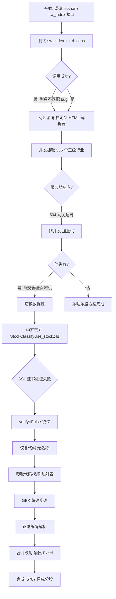

# 申万行业分类成分股数据获取：从踩坑到落地的完整记录

> 技术实现复盘 / Technical Postmortem
>
> 使用 Python + akshare 获取申万一、二、三级行业全部成分股的过程、要点、坑与解决方案
>
> 数据来源：申万宏源研究官方文件 ｜ 分类标准：申万行业分类 2021 版 ｜ 生成日期：2026-06-30

---

## 任务概述

目标是获取申万行业分类（一级、二级、三级）的所有成分股，即每一只 A 股股票当前所属的申万一级行业、二级行业和三级行业。最终交付物是一个 Excel 文件，包含行业层级表和全部成分股明细。

整个实现过程经历了**数据源切换**——从第三方接口（乐咕乐股）起步，遭遇服务端故障后转向申万宏源研究官方数据文件，最终以官方权威数据完成交付。下文完整记录这一过程中的技术决策、关键实现细节和踩过的坑。

| 一级行业 | 二级行业 | 三级行业 | 成分股总数 |
|:---:|:---:|:---:|:---:|
| 31 | 134 | 346 | 5787 |

---

## 数据源调研与对比

开始之前，我调研了三类可获取申万行业分类数据的数据源，它们的特性差异显著：

| 数据源 | 获取方式 | 数据粒度 | 可靠性 | 主要问题 |
|---|---|---|---|---|
| 乐咕乐股 (legulegu) | akshare `sw_index_*` 系列接口 | 按行业逐个拉取成分股 | 中等 | 接口有 bug；服务器易限流/宕机 |
| 申万宏源研究官方 | `StockClassifyUse_stock.xls` | 全量个股分类历史 | 高 | SSL 证书问题；仅含代码无名称 |
| 第三方映射表 | 网页爬取 (sufe.edu.cn) | 代码-名称对照表 | 中高 | 需处理编码；需校验条目数 |

最初的方案是使用 akshare 封装的乐咕乐股接口，因为它同时提供行业层级表和成分股明细。但实际执行中遇到了多重障碍，最终切换到官方数据源。决策流程如下：



> 图 1：数据源选型与故障切换决策流程

---

## 实现过程详解

### 第一阶段：akshare 接口调研

安装 akshare（当前版本 1.18.64）后，通过 `dir(ak)` 筛选出 4 个申万行业相关函数：

```python
sw_index_first_info()   # 申万一级分类表 (31 个)
sw_index_second_info()  # 申万二级分类表 (131 个)
sw_index_third_info()   # 申万三级分类表 (336 个)
sw_index_third_cons()   # 申万三级成分股 (需传入行业代码)
```

前三个函数返回行业层级表，包含行业代码、名称、成份个数和估值指标。数据源是乐咕乐股网站（legulegu.com），通过解析 HTML 页面提取数据。第四个函数 `sw_index_third_cons` 用于获取单个三级行业的成分股明细，需要逐个调用 336 次。

### 第二阶段：遭遇 akshare 接口 bug

测试 `sw_index_third_cons(symbol='850111.SI')` 时直接报错：

```
ValueError: Length mismatch: Expected axis has 18 elements,
new values have 17 elements
```

阅读 akshare 源码（`index/index_sw.py` 第 213 行）后发现，函数硬编码了 17 个列名，但实际网页表格返回了 18 列——数据源新增了一个"细分概念"列，导致列数不匹配。此外，HTML 表头中还混入了 JSON-LD schema 元数据文本，污染了列名。

解决方案是绕过 akshare 封装，直接请求网页并用正则清洗列名：

```python
def clean_col(name):
    """去掉表头里混入的 JSON-LD schema 文本"""
    return re.split(r"\s*\{", str(name))[0].strip()

def fetch_third_cons(symbol, retries=6):
    url = f"https://legulegu.com/stockdata/index-composition?industryCode={symbol}"
    r = requests.get(url, headers=HEADERS, timeout=45)
    df = pd.read_html(StringIO(r.text))[0]
    df.columns = [clean_col(c) for c in df.columns]
    keep = ["股票代码", "股票简称", "纳入时间", "申万3级", "细分概念"]
    df = df[[c for c in keep if c in df.columns]].copy()
    df["三级行业代码"] = symbol
    return df
```

### 第三阶段：并发抓取与服务器限流

方案是用 5 线程并发遍历 336 个三级行业获取成分股，再通过层级表映射一二级行业。但运行后很快出现大量 **504 Gateway Timeout** 错误（Tengine 网关返回），失败率持续攀升。

调整策略：将并发降至 3、超时延长到 45 秒、重试次数增加到 6 次，并在主循环结束后对失败项做单线程补抓。但 legulegu 服务器随后**全面返回 504**，连行业层级表接口也失效了，说明是服务端整体故障而非简单限流。

> **关键转折**：第三方数据源的稳定性不可控。当服务器宕机时，无论怎么调整重试策略都无法解决根本问题。这迫使方案切换到更权威的官方数据源。

### 第四阶段：切换至申万官方数据源

在 akshare 中发现 `stock_industry_clf_hist_sw()` 函数，它直接下载申万宏源研究官方的 `StockClassifyUse_stock.xls` 文件，包含全部 A 股的行业分类变动历史。这个数据源有三个优势：单次下载即获全量数据、来自官方权威、无需逐个行业抓取。

但官方文件只包含**股票代码和 6 位行业代码**，没有行业名称。还需要一份代码到名称的映射表。通过搜索找到了上海财经大学天相数据库页面，上面有完整的"申万行业代码 2021 版"对照表。

### 第五阶段：编码坑与最终组装

下载映射表后用 `pd.read_html` 解析，发现中文全是乱码。原因是该网页使用 **GBK/GB18030 编码**，但 requests 默认按 ISO-8859-1 解码。修正编码后成功获得 346 条三级映射记录，与官方标准（31 一级 / 134 二级 / 346 三级）完全吻合。

最后用 A 股股票名称表（`ak.stock_info_a_code_name()`）补充股票简称，通过 6 位代码的前缀派生一二级代码并映射名称，取每只股票最新计入日期的分类作为当前分类，输出到 Excel。

---

## 申万行业代码体系解析

理解申万行业的 6 位代码结构是实现映射的基础。2021 版分类标准中，代码采用层级嵌套的编码方式：

| 代码位数 | 对应层级 | 代码示例 | 名称 | 派生规则 |
|---|---|---|---|---|
| 前 2 位 + `0000` | 一级行业 | `110000` | 农林牧渔 | `行业代码[:2] + "0000"` |
| 前 4 位 + `00` | 二级行业 | `110100` | 种植业 | `行业代码[:4] + "00"` |
| 完整 6 位 | 三级行业 | `110101` | 种子 | 行业代码本身 |

这意味着只要拿到三级行业代码，就能通过字符串截取派生出一级和二级代码，再查映射表获得名称。例如股票代码 `000001`（平安银行）的行业代码是 `480301`，派生出一级 `480000`（银行）、二级 `480300`（股份制银行Ⅱ）、三级 `480301`（股份制银行Ⅲ）。

> **命名约定**：申万分类中部分二、三级行业名称带有罗马数字后缀（如"林业Ⅱ"、"特钢Ⅱ"、"综合Ⅲ"），表示该层级下只有一个细分行业时用罗马数字区分层级。这是 2021 版的命名规范，不是数据错误。

---

## 关键技术要点

### 取每只股票的最新分类

官方 `StockClassifyUse_stock.xls` 文件记录的是**分类变动历史**——同一只股票可能有多条记录，对应不同时期的行业归属。例如股票 `000001` 有三条记录：1991 年归入 `440101`、2014 年变更为 `480101`、2021 年变更为 `480301`。

要获取当前分类，需按股票代码分组取"计入日期"最大的那条记录：

```python
hist["计入日期"] = pd.to_datetime(hist["计入日期"], errors="coerce")
hist = hist.sort_values(["股票代码", "计入日期", "更新日期"])
cur = hist.drop_duplicates("股票代码", keep="last")
```

这里用 `sort_values` 配合 `drop_duplicates(keep="last")` 的方式，比 `groupby().last()` 更直观，且能在计入日期相同时用"更新日期"作为次序的 tie-breaker。

### 断点续传机制

遍历 336 个三级行业的方案中（虽然最终未采用，但设计值得记录），加入了断点续传以应对长时间运行中断：

```python
# 读取已有断点
if os.path.exists(CKPT_FILE):
    ck = pd.read_csv(CKPT_FILE, dtype={"三级行业代码": str})
    done = set(ck["三级行业代码"].unique())

todo = [c for c in codes if c not in done]

# 每完成 20 个，追加保存到 CSV
if completed % 20 == 0 and results:
    batch = pd.concat(results, ignore_index=True)
    batch.to_csv(CKPT_FILE, mode="a",
                 header=not os.path.exists(CKPT_FILE),
                 index=False, encoding="utf-8-sig")
    results = []  # 清空已保存的，避免重复写
```

关键细节是 `mode="a"`（追加模式）配合 `header=not os.path.exists(...)`（仅首次写表头），以及写入后清空 `results` 列表避免重复写入。最终合并时用 `drop_duplicates` 去除可能的重复行。

### 层级映射与数据对齐

官方文件和映射表是两个独立数据源，需要通过 6 位代码对齐合并。构建三个查找字典，按层级逐级映射：

```python
# 名称查找字典
l1_name = dict(zip(mp["一级代码"], mp["一级名称"]))
l2_name = dict(zip(mp["二级代码"], mp["二级名称"]))
l3_name = dict(zip(mp["三级代码"], mp["三级名称"]))

# 由三级代码派生一二级代码
cur["一级代码"] = cur["行业代码"].str[:2] + "0000"
cur["二级代码"] = cur["行业代码"].str[:4] + "00"
cur["三级代码"] = cur["行业代码"]

# 查表映射名称
cur["申万一级行业"] = cur["一级代码"].map(l1_name)
cur["申万二级行业"] = cur["二级代码"].map(l2_name)
cur["申万三级行业"] = cur["三级代码"].map(l3_name)
```

映射后检查未匹配项，发现 91 只股票的三级代码不在映射表中——这些都是 2021 版修订前已退市的股票，使用的是旧版代码。这部分数据单独放入"未匹配代码"工作表备查，不影响主数据表的完整性。

---

## 踩坑记录与解决方案

### 坑一：akshare 接口的列数不匹配 bug

> **现象**：`sw_index_third_cons()` 调用时报 `ValueError: Length mismatch: Expected axis has 18 elements, new values have 17 elements`。

原因：akshare 源码硬编码了 17 个列名，但数据源网页新增了"细分概念"列变成 18 列。第三方库封装的数据接口无法及时跟上数据源的变化，是这类爬虫型库的通病。

解决方案：不依赖 akshare 封装，直接请求网页 HTML 并自行解析。同时用正则 `re.split(r"\s*\{", name)` 清除表头中混入的 JSON-LD schema 文本。

### 坑二：乐咕乐股服务器 504 宕机

> **现象**：并发抓取成分股时，大量请求返回 `504 Gateway Timeout`（Tengine 网关），随后服务器全面宕机，所有接口均返回 504。

原因：5 线程并发对乐咕乐股服务器压力过大触发限流，随后服务端整体故障。降并发到 3 并加重试也无法解决，因为根本问题是服务端不可用。

解决方案：果断切换到申万宏源研究官方数据源。这印证了一个原则——**优先选择官方/权威数据源，第三方聚合接口只能作为备选**。

### 坑三：官方数据源 SSL 证书验证失败

> **现象**：调用 `ak.stock_industry_clf_hist_sw()` 报 `SSLError: certificate verify failed: unable to get local issuer certificate`。

原因：沙箱环境中缺少 `swsresearch.com` 的 CA 证书链，导致 HTTPS 证书验证失败。akshare 内部调用 `requests.get()` 时未禁用证书验证。

解决方案：绕过 akshare，直接用 `requests.get(url, verify=False)` 下载文件。需配合 `urllib3.disable_warnings()` 抑制告警。在可信网络环境下这是可接受的折衷。

### 坑四：映射表的 GBK 编码乱码

> **现象**：爬取的代码-名称映射表中，行业名称全是乱码（如 `Å©ÁÖÄÁÓæ`）。

原因：该网页使用 GBK/GB18030 编码，但 `requests` 默认按响应头声明的 `ISO-8859-1` 解码。`r.apparent_encoding` 能正确探测出 `GB18030`。

解决方案：手动用 GBK 解码原始字节流 `r.content.decode("gbk", errors="replace")`，再传入 `pd.read_html` 解析。

### 坑五：历史退市股的旧版代码

> **现象**：91 只股票的 6 位行业代码无法在 2021 版映射表中找到对应名称。

原因：这些股票在 2021 版分类标准修订前就已退市，使用的是旧版（2014 版）行业代码，与新版代码体系不兼容。

解决方案：将这些股票单独放入"未匹配代码"工作表，不纳入主成分股表。主表仅保留能正确映射到 2021 版三级行业的 5787 只股票，保证数据一致性。

---

## 数据校验与最终结果

数据生成后进行了多维度校验，确保结果准确可靠：

### 层级数量校验

映射表的行业数量与申万 2021 版官方标准完全一致：

| 校验项 | 官方标准 | 实际获取 | 状态 |
|---|---|---|---|
| 一级行业数 | 31 | 31 | 一致 |
| 二级行业数 | 134 | 134 | 一致 |
| 三级行业数 | 346 | 346 | 一致 |
| 成分股覆盖一级数 | 31 | 31 | 全覆盖 |

### 分类正确性抽查

对特定行业的成分股进行人工核对：

- **银行-股份制银行**：9 只成分股（平安银行、浦发银行、华夏银行、民生银行、招商银行、兴业银行、光大银行、浙商银行、中信银行），分类正确
- **农林牧渔-种植业-种子**：10 只成分股（隆平高科、登海种业、农发种业等），分类正确
- **层级嵌套**：二级行业的"上级行业"字段正确指向一级行业，三级行业的"上级行业"正确指向二级行业

### 输出文件结构

最终 Excel 文件包含 6 个工作表：

| 工作表 | 内容 | 行数 |
|---|---|---|
| 汇总 | 数据来源、版本、各项统计 | 11 |
| 一级行业 | 31 个一级行业 + 成份个数 | 31 |
| 二级行业 | 134 个二级行业 + 上级行业 + 成份个数 | 134 |
| 三级行业 | 346 个三级行业 + 上级行业 + 成份个数 | 346 |
| 全部成分股 | 5787 只股票的完整三级分类 | 5787 |
| 未匹配代码 | 91 只 2021 版修订前退市股（备查） | 91 |

成分股表字段包括：股票代码、股票简称、交易市场、一二三级代码与名称、计入日期。其中 5528 只有当前股票简称（在市），259 只为修订后退市股。

---

## 经验总结

### 数据源选择的优先级

本次任务最大的教训是**数据源稳定性的优先级高于接口便利性**。乐咕乐股接口虽然封装好、使用方便，但作为第三方聚合数据源，既受限于自身服务器稳定性，又依赖上游网页结构不变。一旦服务端故障或网页改版，整个方案就会瘫痪。

申万宏源研究官方的 `StockClassifyUse_stock.xls` 是最权威的数据源——它由申万官方维护，包含全量个股分类变动历史，单次下载即可获得所有数据。虽然需要额外处理 SSL 和代码映射问题，但这些是确定性的技术问题，可控性远高于第三方接口的随机故障。

### akshare 这类爬虫型库的局限性

akshare 本质上是对各网站数据接口的爬虫封装，存在两个固有风险：一是上游网页结构变化导致接口失效（如本次的列数不匹配 bug），二是上游服务器限流或宕机导致无法获取数据。使用时应做好两手准备——了解每个接口背后的真实数据源，准备直接请求的备选方案。

### 编码问题不可忽视

中文数据源的编码问题是最常见的坑之一。`requests` 库默认按 HTTP 响应头声明的编码解码，但许多中文网站响应头声明不准确（常误标为 ISO-8859-1）。可靠的做法是用 `r.apparent_encoding` 探测实际编码，或直接用 `r.content.decode("gbk")` 手动解码原始字节流。

### 数据校验贯穿始终

在每个关键节点都做了校验：映射表条目数与官方标准比对、映射后检查未匹配项、抽样核对分类正确性、验证层级嵌套关系。这些校验在早期就发现了编码错误和旧版代码问题，避免了交付错误数据。

> **一句话总结**：获取金融行业分类数据时，优先找官方权威数据源（哪怕需要多处理几个技术问题），把第三方接口当备选；遇到障碍时快速判断是"可重试的临时故障"还是"需切换方案的系统性问题"，避免在不可控的外部依赖上空耗时间。

---

*本文档记录了使用 Python + akshare 获取申万行业分类成分股的完整技术实现过程。数据来源为申万宏源研究官方文件及申万行业代码 2021 版映射表。生成日期 2026-06-30。*
